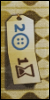
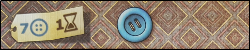

# Patchwork Game

## Motivation
The project is originally developed in the course of Australian National University, College of Engineering and Computer Science, COMP 1140, Assignment 2. Aiming at building the patchwork game in Java and developing a computer opponent for the game.
Although the assignment was completed, it was found that the project was still valuable in 
researching and developing machine learning on this game. With the permission of all authors, the project is open sourced
under license Apache 2.0 for all people who is interested in this area.

## Special thanks
Several people had contributed to this project before its being open sourced but not linked or shown in the GitHub:
Adonis Mouti, Weitao Chen, Steve Blackburn and Xueqin Cui.
    
## File Structure
1. `assets` is the file storing images for README
2. `data` is file storing game playing records by several level of AIs
3. `model` are mainly the h5 models that built under the python framework Keras
4. `pyscript` are python scripts written in the Keras framework for machine learning
5. `src` is the main file storing all java classes, among these files,
    1. `AITraining` is the file that calls AI methods and outputs the playing record
    2. `Matrix` is the simple matrix library built for matrix calculation in Neural Network
    3. `MCTS` is a class **still building**, attempting to training the AI by Monte-Carlo Search Tree
    4. `PatchworkAI` is the class that implements parts of the AI and provides actions to the game
    5. `State` is the class implementing the player's logic in the game
    6. `Viewer` is mainly written in JavaFx for visualising the game(can be played in `game.jar` under the root file)
6. `tests` is the file containing tests testing the correctness and functionality of the program    
    
## Game Introduction
#### Objective

The game consists of a number of *patch tiles*, some *buttons* which serve
as the currency of the game, two 9x9 square *quilt boards* (one for each
player), and a *time board* (pictured below).

The object of the game is to purchase patches and place them on your quilt
board in such a way as to maximize your score at the end of the game.
Your score is calculated as the number of buttons you hold, subtracting 2
points for each empty space of your quilt board.
The game ends when both players have reached the last space of the time
board, which is the large red square in the center.

#### Patch Tiles

There are 33 ordinary patches of different shapes and sizes, labelled 'A'-'Z' and 'a'-'g'.
(Note: 'A' is a distinctly different patch from 'a'.)
Each ordinary patch is labelled with its cost, both in buttons and in time.
The button cost is shown on the label in blue (next to an icon of a
button) and the time cost is shown in brown (next to a icon of an hourglass).
Some patches also generate income; this is shown by one or more blue buttons
on the patch.

For example, the 'E' patch has a button cost of 3 and a time cost of 2, and
generates a button income of 1:

The full set of 33 standard patches is:

There are also five special 1x1 patches, which are all labelled 'h'.

#### Encoding Game State

Each player has some number of buttons, and a time token on a particular square of the time board.
A player starts with five buttons, at square 0 on the time board.

Game states are encoded as strings.  Your game will need to be able to initialize
itself using these strings and some of your tasks relate directly to these strings.
An example of such an encoded game state is given [below](#Example_Game).

##### Patch Circle String

At the beginning of the game, the 33 ordinary patches are laid out in a
random order in a circle.
The order of the patch circle is specified by a patch circle string, which
consists of the 33 characters 'A'-'Z' and 'a'-'g' in a random order,
for example: "agCUfWABQDOdMbZEGVLcFeHSIJNTXKPYR".

A maximum of three patches are available for purchase on any turn.
Throughout the game, the *neutral token* moves around the circle; at any
time, the three patches immediately after the neutral token are available
for purchase.
At the beginning of the game, the neutral token is placed directly after the
'A' patch (the smallest ordinary patch, 2x1).
Whenever a patch is purchased, the neutral token is moved to the position of
that patch in the circle.
(There are never any 'gaps' in the circle - the next three patches after the
neutral token are always available, no matter how many patches have been
purchased and removed from the circle.)

##### Placement Strings

Each patch tile's position is described in terms of its origin, which is the top
left-most square when in its unrotated state (as illustrated above).

A *patch placement string* usually consists of four characters describing the location
and orientation of a particular patch on a player's 9x9 quilt board:

* The first character identifies which of the 34 tile-types is being placed ('A' to 'Z' or 'a' to 'h').
* The second character identifies the column in which the origin of the tile is placed ('A' to 'I').
* The third character identifies the row in which the origin of the tile is placed ('A' to 'I').
* The fourth character identifies which orientation the tile is in ('A' to 'H').

The default (unrotated) orientation is 'A'. Orientation 'B' means the tile is rotated 90 degrees clockwise;
'C' means the tile is rotated 180 degrees, and 'D' means the tile is rotated 270 degrees clockwise.
Rotations 'E' through 'H' mean the tile is flipped horizontally (i.e. reflected about the y-axis)
before rotating clockwise.

Assume that in its default orientation, a piece is M columns wide and N
rows tall.
After a 90 degree rotation, it will be N columns wide and M rows tall.
To make rotation regular and ensure that rotated pieces correctly align
with the quilt board squares, rotation is performed so that the top-left
hand corner of the MxN bounding box is always in the same place.

For example, the following pictures show the 'O' piece at column 'B',
row 'B', the first with rotation 'A' and the second with rotation 'D'.
It has been rotated within a 2x4 rectangle with the origin at ('B','B').
The origin is indicated with a red dot in the top left corner of the
bounding box.

A complete game *placement string* is encoded as a sequence of patch placement strings.
Initially, the game placement string is empty, and it is appended to each time the player places a patch.
Because each ordinary patch is unique, each tile type may only appear at most once in the placement string.
The only exception is the special 1x1 patch, of which there are five identical tiles.
Therefore the special patch may appear up to five times in total in the game state string.

On any turn instead of placing a patch, a player may instead choose to
advance their time token to the next square after the other player's
time token, and receive a number of buttons equal to the number of squares
moved.
To represent this choice, a special single-character patch placement string is used: ".".

#### Example Game

The following diagram shows both players' quilt boards after four patch
tiles have been placed.

The following sequence shows the progression of turns that led to the board
layout above.
Note: players' turns do not necessarily alternate.
Each patch tile has a *time cost* (shown next to the hourglass symbol);
after purchasing and placing a patch, the player moves their token forward
the time board.
The player whose time token is furthest behind on the time board takes the
next turn.
If both time tokens are on the same space on the time board, the player
whose token is on top (i.e. who last moved to that space) takes the next turn.

##### BDCA
Player 1 places the 'B' tile in column 'D', row 'C', unrotated
(rotation 'A').
The 'B' tile has a time cost of 3, so she moves her token forward 3 on the
time board.

##### BDCAUAAA
Player 2 places the 'U' tile in column 'A', row 'A', unrotated.
The 'U' tile also has a time cost of 3, so he moves his token forward 3 on
the time board.

##### BDCAUAAAEACA
Both players are at square 3 on the time board, but Player 2's token is on
top, so Player 2 gets to move again.
Player 2 places the 'E' tile at location 'AC', unrotated.
The 'E' tile has a time cost of 2, so he moves his token forward 2 on
the time board.

##### BDCAUAAAEACAdBDB
Now Player 2's token is in front, so it is Player 1's turn again.
She places the 'd' tile at location 'BD', rotated 90 degrees clockwise
(rotation 'B').
The 'd' tile has a time cost of 2, so she moves her token forward 2 on the
time board.

##### Legal Tile Placements

Tiles must be placed according to the [rules](http://lookout-spiele.de/wp-content/uploads/Patchwork_Rules_US.pdf)
of the game, with the additional constraint that no part of the tile may extend
beyond the 9x9 square playing board.
No two tiles may overlap.

##### Special Events

Certain spaces on the time board are specially marked.

Squares 20, 26, 32, 44, and 50 are marked with special patches (a brown
square patch); the first player to reach each of these squares receives a
special 1x1 'h' patch, which must be placed on their quilt board immediately.

Squares 5, 11, 17, 23, 29, 35, 41, 47, and 53 are marked with a button;
whenever either player reaches one of these squares, she receives a number
of buttons according to the number of buttons shown on the patches already
placed on her quilt board.

##### Scoring

Each player's score is calculated as follows:
* score one point for each button the player holds;
* for each uncovered square on the quilt board, subtract 2 points.

The player with the highest score wins.
In case of a tie, the player who reached the final space of the time board first wins.

