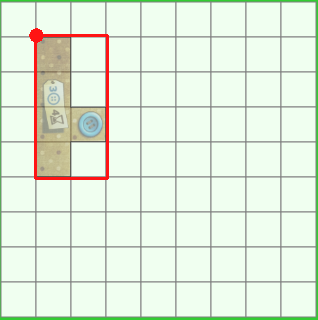
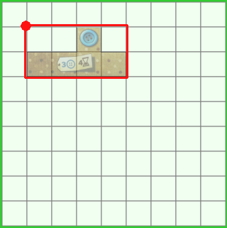

# COMP1140 Assignment 2

*This assignment is only for those enrolled in COMP1140.
COMP1110 and COMP6710 students should look [here](https://gitlab.cecs.anu.edu.au/comp1110/comp1110-ass2).*

## Academic Honesty and Integrity

Honesty and integrity are of utmost importance. These goals are *not* at odds
with being resourceful and working collaboratively. You *should* be resourceful
and you should discuss the assignment
and other aspects of the course with others taking the class. However, *you must
never misrepresent the work of others as your own*. If you have taken ideas from
elsewhere or used code sourced from elsewhere, you must say so with *utmost
clarity*. At each stage of the assignment you will be asked to submit a statement
of originality, either as a group or as individuals. This statement is the place
for you to declare which ideas or code contained in your submission were sourced
from elsewhere.

Please read the ANU's [official position](http://academichonesty.anu.edu.au/) on
academic honesty. If you have any questions, please ask me.

For each phase, you must complete a statement of originality (in the 
[admin directory](admin).
Edit the statement and update it as you complete each task, ensuring that when you 
complete each phase of the assignment, a truthful statement is committed
and pushed to your repo.

## Purpose

In this assignment you will exercise a number of major themes of the course,
including software design and implemention, using development tools such as
Git and IntelliJ, using JavaFX to build a user interface.  For COMP1140 students,
this assignment has the additional purpose of exploring strategies for writing
agents that play games *(there is a guest lecture in week four for 1140 students
that addresses this element of the assignment)*.  Above all, this assignment will
emphasize group work.

## Assignment Deliverables

The assignment is worth 25% of your total assessment, and it will be marked out
of 25. So each mark in the assignment corresponds to a mark in your final
assessment for the course. Note that for some stages of the assignment you 
will get a _group_ mark, and for others you will be _individually_ marked. The
mark breakdown and the due dates are described on the
[deliverables](http://cs.anu.edu.au/courses/COMP1110/deliverables.html) page.

Your work will be marked via your tutor accessing git, so it is essential that
you carefully follow instructions for setting up and maintaining your group
repository. At each deadline you will be marked according to whatever is
committed to your repository at the time of the deadline. You will be assessed
on how effectively you use git as a development tool.

## Problem Description

In this assignment, you will use Java to create a simplified version of a two-player
abstract strategy game called [Patchwork](https://boardgamegeek.com/boardgame/163412/patchwork)
made by the German games developer [Lookout Games](http://lookout-spiele.de/).
BoardGameGeek has an [overview](https://boardgamegeek.com/boardgame/163412/patchwork),
including a handful of [videos](https://boardgamegeek.com/boardgame/163412/patchwork/videos/all),
including a [two minute tutorial](https://boardgamegeek.com/video/128863/patchwork/how-play-patchwork-2-minutes-rules-girl).

Lookout Games has published the [full rules for Patchwork](http://lookout-spiele.de/wp-content/uploads/Patchwork_Rules_US.pdf).
BoardGameGeek also has a photograph of [the Patchwork game components](https://boardgamegeek.com/image/2371709/w-eric-martin?size=large).

#### Objective

The game consists of a number of *patch tiles*, some *buttons* which serve
as the currency of the game, two 9x9 square *quilt boards* (one for each
player), and a *time board* (pictured below).

The object of the game is to purchase patches and place them on your quilt
board in such a way as to maximize your score at the end of the game.
Your score is calculated as the number of buttons you hold, subtracting 2
points for each empty space of your quilt board.
The game ends when both players have reached the last space of the time
board, which is the large red square in the center.

#### Patch Tiles

There are 33 ordinary patches of different shapes and sizes, labelled 'A'-'Z' and 'a'-'g'.
(Note: 'A' is a distinctly different patch from 'a'.)
Each ordinary patch is labelled with its cost, both in buttons and in time.
The button cost is shown on the label in blue (next to an icon of a
button) and the time cost is shown in brown (next to a icon of an hourglass).
Some patches also generate income; this is shown by one or more blue buttons
on the patch.

For example, the 'E' patch has a button cost of 3 and a time cost of 2, and
generates a button income of 1:

The full set of 33 standard patches is:

There are also five special 1x1 patches, which are all labelled 'h'.

#### Encoding Game State

Each player has some number of buttons, and a time token on a particular square of the time board.
A player starts with five buttons, at square 0 on the time board.

Game states are encoded as strings.  Your game will need to be able to initialize
itself using these strings and some of your tasks relate directly to these strings.
An example of such an encoded game state is given [below](#Example_Game).

##### Patch Circle String

At the beginning of the game, the 33 ordinary patches are laid out in a
random order in a circle.
The order of the patch circle is specified by a patch circle string, which
consists of the 33 characters 'A'-'Z' and 'a'-'g' in a random order,
for example: "agCUfWABQDOdMbZEGVLcFeHSIJNTXKPYR".

A maximum of three patches are available for purchase on any turn.
Throughout the game, the *neutral token* moves around the circle; at any
time, the three patches immediately after the neutral token are available
for purchase.
At the beginning of the game, the neutral token is placed directly after the
'A' patch (the smallest ordinary patch, 2x1).
Whenever a patch is purchased, the neutral token is moved to the position of
that patch in the circle.
(There are never any 'gaps' in the circle - the next three patches after the
neutral token are always available, no matter how many patches have been
purchased and removed from the circle.)

##### Placement Strings

Each patch tile's position is described in terms of its origin, which is the top
left-most square when in its unrotated state (as illustrated above).

A *patch placement string* usually consists of four characters describing the location
and orientation of a particular patch on a player's 9x9 quilt board:

* The first character identifies which of the 34 tile-types is being placed ('A' to 'Z' or 'a' to 'h').
* The second character identifies the column in which the origin of the tile is placed ('A' to 'I').
* The third character identifies the row in which the origin of the tile is placed ('A' to 'I').
* The fourth character identifies which orientation the tile is in ('A' to 'H').

The default (unrotated) orientation is 'A'. Orientation 'B' means the tile is rotated 90 degrees clockwise;
'C' means the tile is rotated 180 degrees, and 'D' means the tile is rotated 270 degrees clockwise.
Rotations 'E' through 'H' mean the tile is flipped horizontally (i.e. reflected about the y-axis)
before rotating clockwise.

Assume that in its default orientation, a piece is M columns wide and N
rows tall.
After a 90 degree rotation, it will be N columns wide and M rows tall.
To make rotation regular and ensure that rotated pieces correctly align
with the quilt board squares, rotation is performed so that the top-left
hand corner of the MxN bounding box is always in the same place.

For example, the following pictures show the 'O' piece at column 'B',
row 'B', the first with rotation 'A' and the second with rotation 'D'.
It has been rotated within a 2x4 rectangle with the origin at ('B','B').
The origin is indicated with a red dot in the top left corner of the
bounding box.

A complete game *placement string* is encoded as a sequence of patch placement strings.
Initially, the game placement string is empty, and it is appended to each time the player places a patch.
Because each ordinary patch is unique, each tile type may only appear at most once in the placement string.
The only exception is the special 1x1 patch, of which there are five identical tiles.
Therefore the special patch may appear up to five times in total in the game state string.

On any turn instead of placing a patch, a player may instead choose to
advance their time token to the next square after the other player's
time token, and receive a number of buttons equal to the number of squares
moved.
To represent this choice, a special single-character patch placement string is used: ".".

#### Example Game

The following diagram shows both players' quilt boards after four patch
tiles have been placed.

The following sequence shows the progression of turns that led to the board
layout above.
Note: players' turns do not necessarily alternate.
Each patch tile has a *time cost* (shown next to the hourglass symbol);
after purchasing and placing a patch, the player moves their token forward
the time board.
The player whose time token is furthest behind on the time board takes the
next turn.
If both time tokens are on the same space on the time board, the player
whose token is on top (i.e. who last moved to that space) takes the next turn.

##### BDCA
Player 1 places the 'B' tile in column 'D', row 'C', unrotated
(rotation 'A').
The 'B' tile has a time cost of 3, so she moves her token forward 3 on the
time board.

##### BDCAUAAA
Player 2 places the 'U' tile in column 'A', row 'A', unrotated.
The 'U' tile also has a time cost of 3, so he moves his token forward 3 on
the time board.

##### BDCAUAAAEACA
Both players are at square 3 on the time board, but Player 2's token is on
top, so Player 2 gets to move again.
Player 2 places the 'E' tile at location 'AC', unrotated.
The 'E' tile has a time cost of 2, so he moves his token forward 2 on
the time board.

##### BDCAUAAAEACAdBDB
Now Player 2's token is in front, so it is Player 1's turn again.
She places the 'd' tile at location 'BD', rotated 90 degrees clockwise
(rotation 'B').
The 'd' tile has a time cost of 2, so she moves her token forward 2 on the
time board.

##### Legal Tile Placements

Tiles must be placed according to the [rules](http://lookout-spiele.de/wp-content/uploads/Patchwork_Rules_US.pdf)
of the game, with the additional constraint that no part of the tile may extend
beyond the 9x9 square playing board:
* Tiles may be placed adjacent to any other tile (edge touching edge).
* No two tiles may overlap.

##### Special Events

Certain spaces on the time board are specially marked.

Squares 20, 26, 32, 44, and 50 are marked with special patches (a brown
square patch); the first player to reach each of these squares receives a
special 1x1 'h' patch, which must be placed on their quilt board immediately.

Squares 5, 11, 17, 23, 29, 35, 41, 47, and 53 are marked with a button;
whenever either player reaches one of these squares, she receives a number
of buttons according to the number of buttons shown on the patches already
placed on her quilt board.

##### Scoring

Each player's score is calculated as follows:
* score one point for each button the player holds;
* for each uncovered square on the quilt board, subtract 2 points.

The player with the highest score wins.
In case of a tie, the player who reached the final space of the time board first wins.

## Legal and Ethical Issues

First, as with any work you do, you must abide by the principles of 
[honesty and integrity](http://academichonesty.anu.edu.au). 
I expect you to demonstrate honesty and integrity in everything you do.

In addition to those ground rules, you are to follow the rules one would 
normally be subject to in a commercial setting. In particular, you may make use
of the works of others under two fundamental conditions: 
a) your use of their work must be clearly acknowledged, and 
b) your use of their work must be legal (for example, consistent with any
copyright and licensing that applies to the given material). 
*Please understand that violation of these rules is a very serious offence.*
However, as long as you abide by these rules, you are explicitly invited to
conduct research and make use of a variety of sources. 
You are also given an explicit means with which to declare your use of other
sources (via originality statements you must complete).
It is important to realize that you will be assessed on the basis of your
original contributions to the project. 
While you won't be penalized for correctly attributed use of others' ideas,
the work of others will not be considered as part of your contribution.
Therefore, these rules allow you to copy another student's work entirely if:
a) they gave you permission to do so, and
b) you acknowledged that you had done so.
Notice, however, that if you were to do this you would have no original
contribution and so would recieve no marks for the assigment (but you would
not have broken any rules either).

## Evaluation Criteria

It is essential that you refer to the [deliverables page](https://cs.anu.edu.au/courses/comp1110/assessments/deliverables/) to check that you understand each of the deadlines and what is required.   Your assignment will be marked via git, so all submittable materials will need to be in git and in the *correct* locations, as prescribed by the [deliverables page](https://cs.anu.edu.au/courses/comp1110/assessments/deliverables/).

**The mark breakdown is described on the
[deliverables](https://cs.anu.edu.au/courses/comp1110/assessments/deliverables/) page.**

### Part One

In the first part of the assignment you will:
* Create a skeleton of your *initial* design for the final assignment (Task #2).
* Implement parts of the text interface to the game (Tasks #3, #4, and #6).
* Implement a simple viewer that allows you to visualise game states (Task #5).

The criteria for the [completion of part one](https://gitlab.cecs.anu.edu.au/comp1110/comp1110/wikis/deliverables#d2c-assignment-2-stage-c-2-marks-group)
is as follows:

**Pass**
* Tasks #2, #3 and #4.

**Credit**
* Task #5 *(in addition to all tasks required for Pass)*.

**Distinction**
* Task #6 *(in addition to all tasks required for Credit)*.

### Part Two

Create a fully working game, using JavaFX to implement a playable graphical
version of the game in a 933x700 window.
You will be able to play your game against another human or against the
computer.

Notice that aside from the window size, the details of exactly how the game
looks and plays are **intentionally** left up to you.
The diagrams above are for illustration purposes only.
However, you are provided with images for each of the thirty-three pieces,
which you may use.

The only **firm** requirements are that:

* you use Java and JavaFX,
* the game respects the specification of the game given here,
* the game be easy to play,
* it runs in a 933x700 window, and
* that it is executable on a standard lab machine from a jar file called `game.jar`,

Your game must successfully run from `game.jar` from within another user's (i.e.
your tutor's) account on a standard lab machine (in other words, your game must
not depend on features not self-contained within that jar file and the Java 8 
runtime).

**Pass**
* Correctly implements all of the <b>Part One</b> criteria.
* Appropriate use of git (as demonstrated by the history of your repo).
* Completion of Task #7.
* Executable on a standard lab computer from a runnable jar file, game.jar, which resides in the root level of your group repo.

**Credit**
* _All of the Pass-level criteria, plus the following..._
* Task #8.

**Distinction**
* _All of the Credit-level criteria, plus the following..._
* Tasks #9, #10 and #11.

**High Distinction**
* _All of the Distinction-level criteria, plus the following..._
* Task #12.
